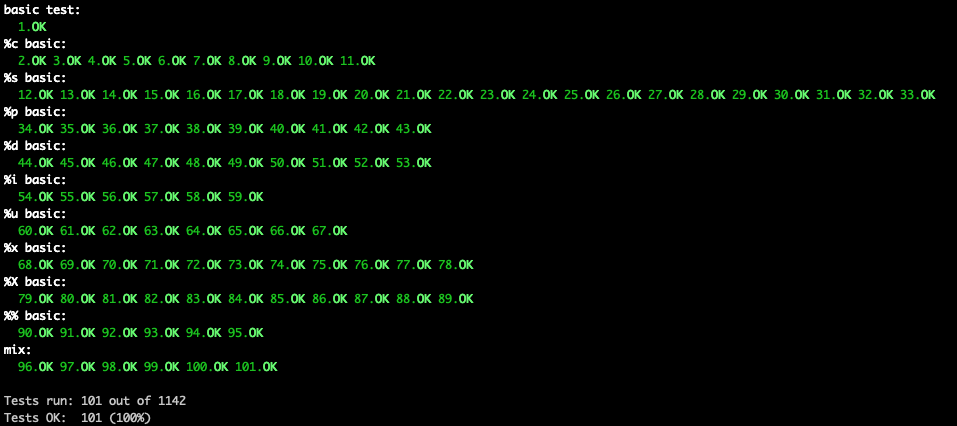
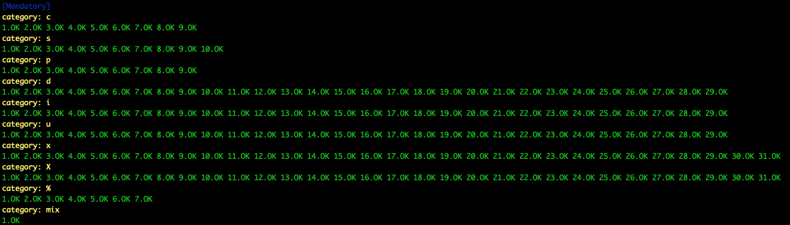

# ft_printf
> The goal of this project is pretty straightforward. You will recode printf().


### Content
```diff
+ Mandatory part is done. Still considering if I should try for the bonus.
```
**Source files:**
[ft_printf.c](srcs/ft_printf.c)
| [ft_putchar.c](srcs/ft_putchar.c)
| [ft_putstr.c](srcs/ft_putstr.c)
| [ft_itoa.c](srcs/ft_itoa.c)
| [ft_utoa.c](srcs/ft_utoa.c)
| [ft_printhex.c](srcs/ft_printhex.c)
| [ft_pflag.c](srcs/ft_pflag.c)

**Header File:**
[ft_printf.h](libs/ft_printf.h)

**Makefile:**
[Makefile](Makefile)

## Test results
Test by **[Paulo Santana](https://github.com/paulo-santana/ft_printf_tester)**<br />


Test by **[Tripouille](https://github.com/Tripouille/printfTester)**<br/>



## 📝 License

This project is licensed. Check out [LICENSE](LICENSE) for more details.

[⬆ Back to the top](#ft_printf)
